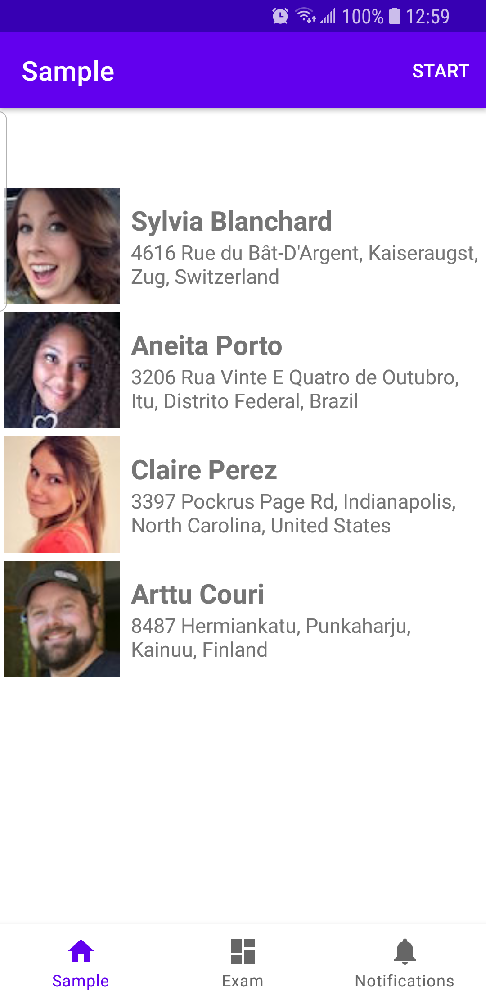

# androidLiveCodingExam1
Android Live Coding Exam 1

## Time Duration

1. Pre Session: 15 minutes
- Clone source code, run app with Android Studio
- Read exercises carefully and prepare the solution
- 5 minutes to show up solution before start coding

2. Coding Session: 60 minutes

- Must implement all **Required exercise**
- Require the code can be complied and run success on Android Emulator or Real Device
- Can use all third parties, includes all third parties that already set up
- Interviewer can make questions during this session

3. Post Session: 15 minutes

- Candidate zip the code and send to interviewer
- Interviewer ask about pros and cons about the solution and implementation
- Candidate needs give more solutions about some improvements or new features 

## Prerequisite

- Android Studio Arctic Fox 2020.3.1 or above
- Library is already set up:
  + Recycler View: `'androidx.recyclerview:recyclerview:1.2.1'`
  + Image Loader: 

## Exercise

App has 2 tabs:
1. Tab 1: **Sample**
- Load list of `Contact` with show on screen with `avatar` `name` and `address`
- The data of contacts is pulled from assets file `/data/contacts.json`

1. Tab 2: **Exam**
- Here is tab that candidate will start implement `Rebuild`

## Exam

1. Refactor
- Analyze current code in tab 1 and show up the current `issue` and then fix it

2. Rebuild

In **tab 2**, rebuild the contact list with required:
### Structure & build layout
- Use and refactor the current **MVVM** model in **tab 2**
- Use **Kotlin** and **Jet Compose** to build layout
- Use **Corountine** to build asynchronous 
- Build one more screen Contact Detail (with defined UI) and navigate from list to detail
- The `avatar` image on screen must be `lazy loading` with `placeholder`

### Unit Test
- Show age-class `young` `middle-age` `old` with conditions:
  + `young`: age < 30
  + `middle-age`: age >= 30 && age < 60
  + `old`: age >= 60
- Write **unit test** for the function to get `age-class` 

### Local Storage & Caching
- Update `Start` button to `Refresh` button in case the list is loaded. Touch on `Refresh` button, call API and reload the contact list
- Cache the contact list in `2 minutes`, don't all API if cache data still is valid, even relaunch the app